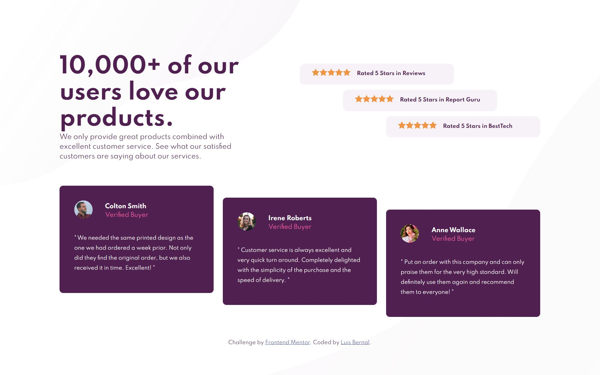

# Frontend Mentor - Social proof section solution

This is a solution to the [Social proof section challenge on Frontend Mentor](https://www.frontendmentor.io/challenges/social-proof-section-6e0qTv_bA). Frontend Mentor challenges help you improve your coding skills by building realistic projects.

## Table of contents

- [Overview](#overview)
  - [The challenge](#the-challenge)
  - [Screenshot](#screenshot)
  - [Links](#links)
- [My process](#my-process)
  - [Built with](#built-with)
  - [What I learned](#what-i-learned)
  - [Continued development](#continued-development)

## Overview

### The challenge

Users should be able to:

- View the optimal layout for the section depending on their device's screen size

### Screenshot

### Links

- Solution URL: [https://github.com/FrontendMentor-Lecap/Social-Proof-Section]
- Live Site URL: [https://frontendmentor-lecap.github.io/Social-Proof-Section/]

## My process

### Built with

- Semantic HTML5 markup
- CSS custom properties
- Flexbox
- CSS Grid
- Mobile-first workflow

### What I learned

I learned about positioning child elements inside parents. I created a grid with a template with 2 columns on the superior row, and only one column in the bottom row. The first cell is the main title with the description paragraph, and they had no particular positioning.
The second cell shows all the ratings, those are ordered with flexbox in a column direction and then they are aligned using the nth-of-child value. Using this strategy I'm able to locate each of the elements in a different place, one in start one in middle and the last one in the end.
For the customer reviews section, I used both columns 1 and 2, positioned each of the child elements using the same strategy as before.

I created CSS variables to save the colors, in order to place them and change them in a faster way.

Also it was my first time using 2 background images and trying to position them in a correct manner. I think I have to keep working on that since it is still a headache to arrange patterns, sizes, positions and origins.

### Continued development

I need to continue improving my positioning skills and the different techniques with elements that sometimes are not that easy to position like rectangles and squares.

Background images positioning is a really big thing to keep improving. It seems harder than the other elements for no particular reason, I just try harder with backgrounds with not that good results.

Other thing I need to continue developing is a responsive page mindset, because the methods I use sometimes are not the best or the most efficient in order to write a cleaner code with better/professional results.
